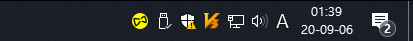
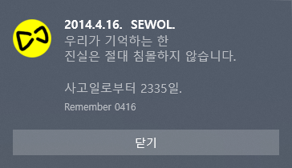
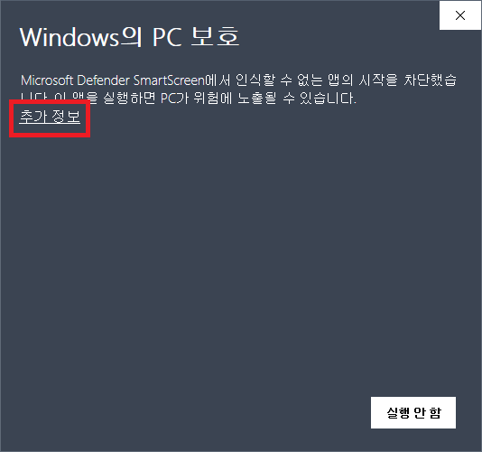
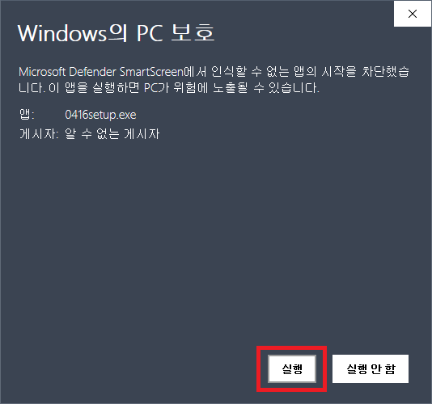

# Remember0416

> 우리가 기억하는 한 
진실은 절대 침몰하지 않습니다.

 
‘Remember 0416’은 윈도10의 작업표시줄에 세월호 노란리본 아이콘을 표시하는 앱입니다.

MacOS용 앱인 [min-uuu/For_0416](https://github.com/min-uuu/For_0416)에 영향을 받아 만들어졌습니다.

## 실행
1. 설치하면 윈도 시작 시 자동으로 시작됩니다. 설치방법은 아래를 참조하여 주십시오.

2. 작업표시줄에 다음과 같이 노란 리본 아이콘이 나타납니다.

3. 아이콘을 클릭하면 메시지가 나타납니다. "사고 정보 보기" 버튼을 누르면 나무위키의 세월호 사고 정보 페이지로 이동합니다.

4. 아이콘을 오른쪽 클릭하면 메뉴가 나타납니다.

## 설치방법
 1. 오른쪽의 'Release' 링크에서 가장 최신 버전을 다운받아 주세요.
   1. [버전 0.1 바로가기](https://github.com/Regentag/Remember0416/releases/tag/0.1)
 2. 설치파일을 실행하면 자동으로 시작 프로그램에 등록됩니다.
 
### ___!!주의!! 설치파일 실행 시 Windows Defender 또는 백신에서 경고가 뜰 수 있습니다.___

이 프로그램은 악성코드인 것이 아닙니다.

단지 프로그램이 인증서로 서명되지 않았기 때문에 발생하는 경고 메시지로, 실제로 보안 문제가 있는것은 아닙니다.

1. Windows Defender SmartScreen에서 실행을 차단할 경우 '추가정보'를 클릭합니다.

2. '실행' 버튼이 나타나면 클릭합니다.

※ 백신에서도 차단할 경우 해제 해 주어야 설치됩니다.

# 원작자의 표시
  * systray - [getlantern/systray](https://github.com/getlantern/systray)
  * toast - [go-toast/toast](https://github.com/go-toast/toast)
  
끝.
