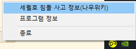

# Remember0416

> 우리가 기억하는 한 
진실은 절대 침몰하지 않습니다.

 
‘Remember 0416’은 윈도10의 작업표시줄에 세월호 노란리본 아이콘을 표시하는 앱입니다.

MacOS용 앱인 [min-uuu/For_0416](https://github.com/min-uuu/For_0416)에 영향을 받아 만들어졌습니다.

## 실행
1. 설치하면 윈도 시작 시 자동으로 시작됩니다. 설치방법은 아래를 참조하여 주십시오.

2. 작업표시줄에 다음과 같이 노란 리본 아이콘이 나타납니다.

3. 아이콘을 클릭하면 메시지가 나타납니다.

4. 아이콘을 오른쪽 클릭하면 메뉴가 나타납니다.

## 설치방법
 1. 오른쪽의 'Release' 링크에서 가장 최신 버전을 다운받아 주세요.
   * [버전 0.2 바로가기](https://github.com/Regentag/Remember0416/releases/tag/0%2C2)
 2. 설치파일을 실행하면 자동으로 시작 프로그램에 등록됩니다.

## 보안 관련
 * 설치 시 Microsoft Defender SmartScreen 또는 백신 소프트웨어의 경고가 발생할 수 있습니다.
 * 설치파일/실행파일이 유료 EV인증서로 서명되지 않았기 때문입니다.
 * "[MS Defender SmartScreen은 인디 개발자를 해치고 있어요](https://getimageview.net/2020/06/02/microsoft-defender-smartscreen-is-hurting-independent-developers/)" 문서를 참조하시기 바랍니다. ([한국어 요약](https://news.hada.io/topic?id=2199))

# 원작자의 표시
  * systray - [getlantern/systray](https://github.com/getlantern/systray)
  * toast - [go-toast/toast](https://github.com/go-toast/toast)

끝.
